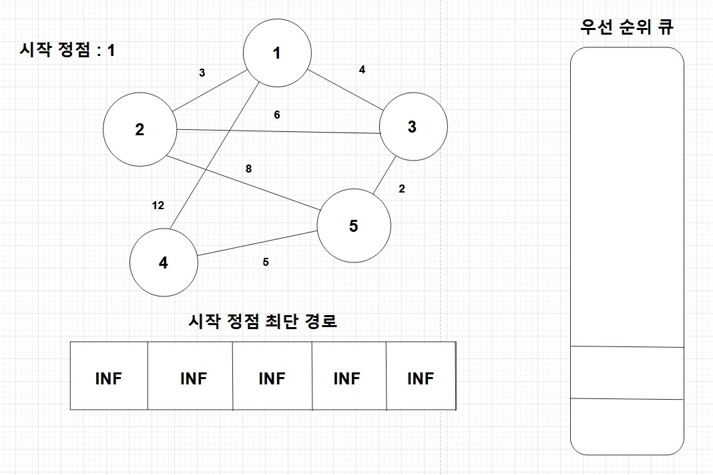

# 📝Dijkstra Algorithm

**특정한 하나의 정점에서 모든 정점으로의 최단 거리**를 구하는 알고리즘  
음의 간선이 들어간 경우에는 사용할 수 없음

일반적으로 우선순위 큐를 이용하여 구현

## 알고리즘

1. 각 노드들까지의 최단 거리 배열 dist를 무한대로 초기화
2. 시작 정점의 dist 값을 0으로 바꾸고, (누적 거리, 노드 번호)를 우선순위 큐에 넣음
3. 우선순위 큐에서 Dequeue하여 나온 노드에 대하여, 해당 노드에서 이어진 노드(및 거리)에 대해 각각 누적 거리를 계산  
    - 그렇게 계산된 누적 거리가 그 노드의 dist값보다 작다면 dist를 갱신하고 그 (누적 거리, 노드 번호)를 우선순위 큐에 넣음, 이후 우선순위 큐가 빌 때까지 반복
4. 최종 dist 배열이 시작 정점에서부터 각 정점으로의 최단 거리


```C#
public List<int> Dijkstra(List<(int weight, int node)>[] maps, int start)
{
    List<int> dist = new List<int>(new int[maps.Length]);    // 노드 개수만큼의 리스트 선언
    MinHeap<Tuple<int, int>> pq = new MinHeap<Tuple<int, int>>();

    for (int i = 1; i < dist.Count; i++)
    {
        dist[i] = INF;        // 모든 정점까지의 거리를 무한대로 초기화
    }

    dist[start] = 0;
    pq.Add(new Tuple<int, int>(dist[start], start));    // Enqueue

    while (pq.Count != 0)
    {
        int distance = pq.GetMin().Item1;               // Peek
        int current = pq.ExtractDominating().Item2;     // Dequeue

        for (int i = 0; i < maps[current].Count; i++)
        {
            int node = maps[current][i].node;
            int weight = distance + maps[current][i].weight;

            // 누적 거리가 그 노드의 dist값보다 작다면 dist를 갱신, 우선순위 큐에 넣음
            if (dist[node] > weight)
            {
                dist[node] = weight;

                pq.Add(new Tuple<int, int>(dist[node], node));  // Enqueue
            }
        }
    }

    return dist;
}
```

```
노드 간 최단거리:
0 3 4 11 6
```
---

### 비고
유니티에서 사용하는 C# 버전은 우선순위 큐를 지원하지 않기 때문에, 아래 링크에 있는 우선순위 큐 구현을 사용하였음  
https://blog.naver.com/ambidext/221285681447

[원본](https://stackoverflow.com/questions/102398/priority-queue-in-net?utm_medium=organic&utm_source=google_rich_qa&utm_campaign=google_rich_qa)
