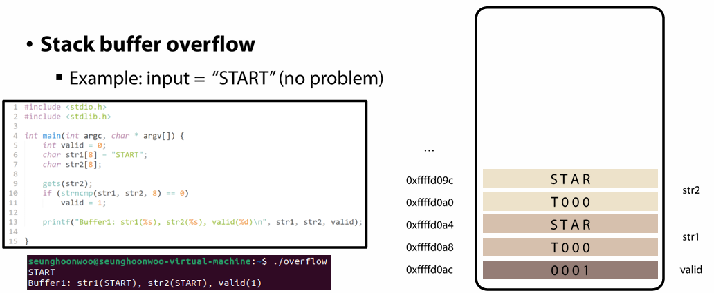
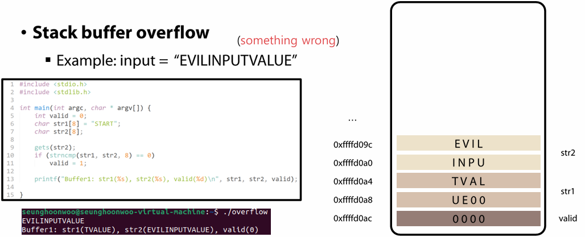
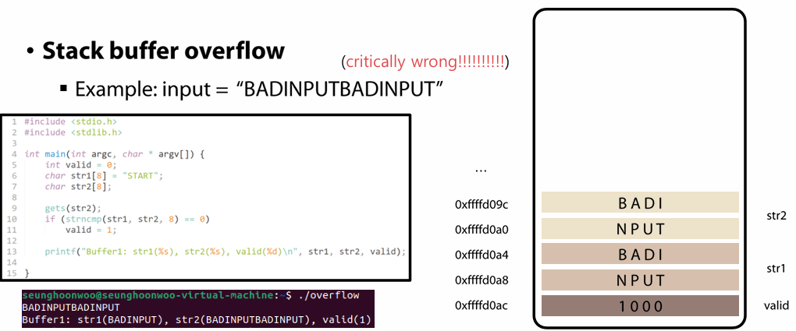
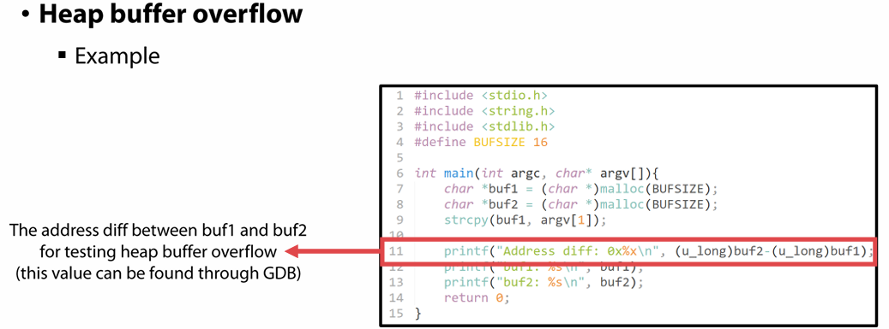
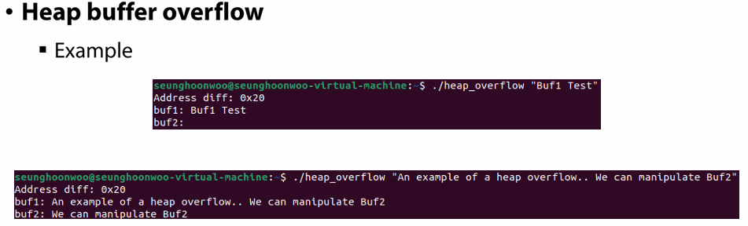

# 🔐Memory Safety

3/10 수업

---

### 메모리란?
프로그램과 데이터가 저장/접근되는 컴퓨터 공간

### Memory Safety란?
프로그램 데이터 구조의 무결성을 보장하는 것
- 공격자의 허용되지 않은 메모리 읽기/쓰기 방지
- 잘못된 메모리 관리로 발생하는 오류 예방

요즘 언어들은 자동으로 메모리 관리를 제공  
but 많은 핵심 시스템은 C/C++과 혼합하여 개발 → 모든 언어가 내부적으로 같은 메모리 모델 위에서 동작

메모리 구조:  
```
---- (Low Address)
TEXT
DATA
HEAP

STACK
---- (High Address)
```

#### TEXT: 실행 가능한 프로그램 코드 저장
CPU는 TEXT 영역에서 명령어를 가져와 실행됨  
read-only  

#### DATA: 전역 변수와 static 변수 저장
메인 함수가 실행되기 전 선언되는 변수들  
프로그램 시작 시에 생성되어 종료까지 유지  

#### HEAP: 동적 메모리
프로그래머가 직접 관리하는 메모리 영역  
malloc(), calloc(), new 등...  
낮은 주소에서 높은 주소 방향으로 증가  

#### STACK: 함수 호출 시 생성되는 메모리
local 변수와 함수 매개변수, return address를 저장  
높은 주소에서 낮은 주소 방향으로 증가  


## Buffer Overflow
Buffer: 데이터를 저장하는 임시 메모리 공간  
Buffer Overflow: 버퍼 크기보다 큰 데이터를 입력하는 경우  
▶ 메모리 손상 / 숨겨진 정보 유출 / 공격자가 원하는 코드 실행 가능

### Buffer Overflow의 종류
#### 1. Stack Buffer Overflow: 
stack 영역의 변수 크기를 넘어 데이터를 쓰는 경우

```
char buf[10];
gets(buf);
-> 20메모리를 입력하면 옆 메모리까지 덮어쓰게 됨
```

##### Stack Frame: 함수가 호출될 때, 함수마다 생성되는 스택 영역 구조
```
---- (Low Address)
로컬 변수들
SFP (stack frame pointer)
RET (return address)
함수의 매개변수들
---- (High Address)
```
함수 종료 시 제거됨

**메모리에 데이터가 저장되는 방식**: Little Endian - Least Significant Byte 먼저 저장  
ex) 0x12345678 -> 78 56 34 12 순으로 저장  
사용하는 이유: CPU 연산 효율(대부분의 CPU가 low byte 데이터 먼저 처리) 및 레지스터 정렬 문제 해결 위함  

**Stack Buffer Overflow가 생기는 예시**  
  
  
  

**Stack Buffer Overflow 공격 원리**  
▶ Return Address(RET) 덮어쓰기!
```
원래 흐름: 함수 종료 후 RET 주소로 복귀
공격: RET 부분을 공격자가 원하는 주소로 덮어쓰기
=> 함수 종료 후 공격 코드 주소로 이동하게 됨
```

#### 2. Heap Buffer Overflow
heap 영역의 변수 크기를 넘어 데이터를 쓰는 경우
```
char *buf1 = malloc(16);
char *buf2 = malloc(16);
strcpy(buf1, input);
-> 입력이 16byte를 초과하면 buf2의 영역까지 덮어쓰게 됨
```
  
  

일반적으로 Stack Buffer Overflow보다 복잡함  
- 컴파일 시점에 힙 영역 크기를 조절할 수 없고, 프로그램 실행에 따라 동적으로 할당됨
