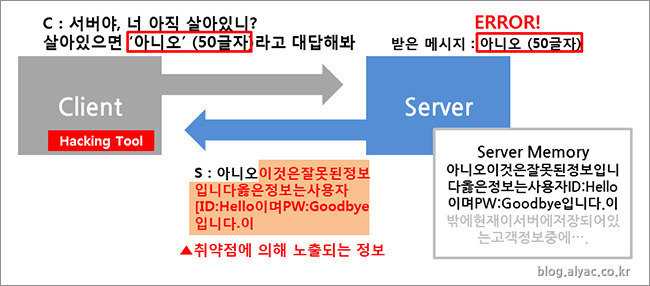

# 🔐Software Security Principles

3/5 수업

## 보안의 정의: CIA
### Confidentiality (기밀성)
데이터와 자원을 **권한이 있는** 사용자에게만 접근을 허용  
암호화(Cryptography)와 인증(Authentication) 과정을 통해 보장됨

### Integrity(무결성)
데이터가 **변경되지 않고 유지**되도록 보장  
권한이 있는 개체(Authentication을 통한 인증)만 정보를 수정할 수 있게 함 + 해시 함수 등으로 변조 여부를 감지

### Availability(가용성)
서비스나 데이터, 프로그램에 **접근할 수 있도록** 보장  
공격자가 서비스 운영을 방해하는 것(ex. DDoS)을 방어, 정당한 사용자가 서비스를 원활하게 이용할 수 있게 함  
데이터 백업 및 복제, 신속한 에러 복구 시스템 구축, 자원에 대한 지속적인 모니터링으로 보장 가능

## 컴퓨터 보안 vs 소프트웨어 보안
소프트웨어 보안: **소프트웨어 시스템의 디자인 및 구현 방법**에 초점을 맞추어 CIA를 지키도록 함

## 용어 정리
### Asset(자원)
모든 보호의 대상 (정보, 소프트웨아, 하드웨어, 서비스 등)
### Vulnerability(취약점)
공격자가 악용할 수 있는 시스템/네트워크/소프트웨어의 보안 약점 또는 결함
- 예시: OpenSSL의 HeartBleed 취약점  

- CVE (Common Vulnerabilities and Exposures): 공개적으로 알려진 보안 취약점의 목록, 'CVE-년도-ID' 형식으로 관리
### Bug(버그)
소프트웨어의 오류나 결함, 모든 버그가 취약점인 것은 아님
### Malware
컴퓨터나 네트워크에 부정적인 영향을 주기 위해 설계된 소프트웨어
### Threat(위협)
손실을 끼칠 가능성이 있는 환경이나 잠재적 위험 요소(해커, 취약점의 존재, 피싱 등)
### Risk(위험)
Threat가 취약점을 악용하여 Asset에 손실을 줄 가능성

취약점이 없다면 위협은 위험이 될 수 없음 -> 취약점을 식별하고 보완하는 위험 관리(Risk Management)가 중요

