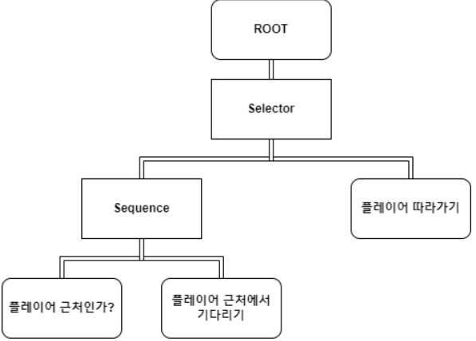

# 📝Behaviour Tree

FSM(Finite State Machine)의 단점을 보완하고 좀 더 쉽게 구조화 

## 기본 원리

Tree의 형태를 하고 있으며, root 노드와 여러 흐름제어 노드들을 통해 최종적으로 리프 노드에 도달하는 형식 

### 노드의 상태
각 노드는 다음과 같은 상태 중 하나 반환
- Success 
- Failure
- Running

### 흐름제어 노드
1. Sequence: AND 역할, 하나라도 Failure가 반환되면 Failure 반환 (다음 흐름제어 노드로 넘어감)
2. Selector: OR 역할, 하나라도 Running이거나 Success이면 바로 반환

각 리프 노드는 **`Evaluate()` 와 같은 함수를 가지고 있어 이 함수에서 각 노드의 행동을 하고 상태를 반환**함

## 사용 방법
```C#
public enum NodeState
{
    Running,
    Failure,
    Success
}

public abstract class Node
{
    protected NodeState state;
    public Node parentNode;
    protected List<Node> childrenNode = new List<Node>();

    public Node()
    {
        parentNode = null;
    }

    public Node(List<Node> children)
    {
        foreach(var child in children)
        {
            AttatchChild(child);
        }
    }

    public void AttatchChild(Node child)
    {
        childrenNode.Add(child);
        child.parentNode = this;
    }

    public abstract NodeState Evaluate();
}
```
- Sequence
```C#
public class SequenceNode : Node
{
    public SequenceNode() : base() {}

    public SequenceNode(List<Node> children) : base(children) {}

    public override NodeState Evaluate()
    {
        bool bNowRunning = false;
        foreach (Node node in childrenNode)
        {
            switch (node.Evaluate())
            {
                case NodeState.Failure:
                    return state = NodeState.Failure;
                case NodeState.Success:
                    continue;
                case NodeState.Running:
                    bNowRunning = true;
                    continue;
                default:
                    continue;
            }
        }

        return state = bNowRunning ? NodeState.Running : NodeState.Success;
    }
}
```

- Selector
```C#
public class SelectorNode : Node
{
    public SelectorNode() : base(){}

    public SelectorNode(List<Node> children) : base(children){}

    public override NodeState Evaluate()
    {
        foreach(Node node in childrenNode)
        {
            switch(node.Evaluate())
            {
                case NodeState.Failure:
                    continue;
                case NodeState.Success:
                    return state = NodeState.Success;
                case NodeState.Running:
                    return state = NodeState.Running;
                default:
                    continue;
            }
        }

        return state = NodeState.Failure;
    }
}
```

각 노드는 BehaviourTree 클래스에서 관리, Update 함수에서 각 노드를 평가함
```C#
public abstract class BehaviourTree : MonoBehaviour
{
    private Node rootNode;

    protected void Start()
    {
        rootNode = SetupBehaviorTree();
    }

    protected void Update()
    {
        if(rootNode is null)    return;
        rootNode.Evaluate();
    }

    protected abstract Node SetupBehaviorTree();
}
```

## 예시
플레이어를 따라다니는 펫



- 플레이어가 가까이에 있는지 확인하는 노드
```C#
public class CheckPlayerIsNearNode : Node
{
    private static int playerLayerMask = 1 << 6;
    private Transform transform;
    private Animator anim;

    public CheckPlayerIsNear(Transform transform)
    {
        this.transform = transform;
        anim = transform.GetComponent<Animator>();
    }

    public override NodeState Evaluate()
    {
        var collider = Physics.OverlapSphere(transform.position, 5.0f, playerLayerMask);
        if(collider.Length <= 0)    return state = NodeState.Failure;

        anim.SetBool("Following", false);
        return state = NodeState.Success;
    }
}
```

- 플레이어 근처에서 기다리는 노드
```C#
public class StayNearPlayerNode : Node
{
    private Animator anim;

    public StayNearPlayerNode(Transform transform)
    {
        anim = transform.GetComponent<Animator>();
    }

    public override NodeState Evaluate()
    {
        anim.SetBool("Following", false);

        return state = NodeState.Running;
    }
}
```

- 플레이어에게로 가까이 다가가는 노드
```C#
public class GoToPlayerNode : Node
{
    private Transform player;
    private Transform transform;
    private Animator anim;

    public GoToPlayerNode(Transform player, Transform transform)
    {
        this.player = player;
        this.transform = transform;
        anim = transform.GetComponent<Animator>();
    }

    public override NodeState Evaluate()
    {
        transform.LookAt(player);
        transform.position = Vector3.Lerp(transform.position, player.position, Time.deltaTime);
        anim.SetBool("Following", true);

        return state = NodeState.Running;
    }
}
```

- 최종적으로 Behaviour Tree 구성
```C#
public class FollowingPlayerPetBT : BehaviourTree
{
    [SerializeField]
    private Transform player;
    [SerializeField]
    private Transform pet;

    protected override Node SetupBehaviorTree()
    {
        Node root = new SelectorNode(new List<Node>
        {
            new SequenceNode(new List<Node>
            {
                new CheckPlayerIsNear(pet),
                new StayNearPlayerNode(pet)
            }),
            new GoToPlayerNode(player, pet)
        });
        return root;
    }
}
```
