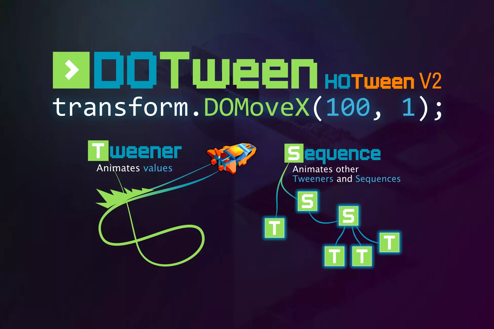

# 📝 DOTween

DOTween: 게임오브젝트의 자연스러운 변환을 지원해주는 에셋
- 내부적으로 최적화 기법을 사용해 유니티가 제공하는 일반적인 애니메이션/Transform 관련 함수/코루틴보다 향상된 성능을 보임 (성능상의 오버헤드를 줄이기 위해 custom update 함수를 사용)


https://assetstore.unity.com/packages/tools/animation/dotween-hotween-v2-27676


## DOTween 시작하기

**기존 Lerp 코드**
1초 동안 오브젝트를 이동시키는 코드
```C#
void Update() {
    if (currentValue < 1.0f) {
        currentValue += Time.deltaTime;
        transform.position = Vector3.Lerp(startPos, targetPos, currentValue);
    }
}
```

**DOTween을 사용한 코드**
```C#
void Start() {
    transform.DOMove(targetPos, 1.0f);
}
```

### 기본 설정

1. 라이브러리 선언
`using DG.Tweening;`

2. Init 함수를 통한 기본 설정 (선택 사항)
`DOTween.Init(bool autoKillMode, bool useSafeMode, LogBehaviour logBehaviour).SetCapacity(int , int);`
`autoKillMode`: 한번 사용한 DOTween을 재사용할지
`useSafeMode`: 실행 대상이 파괴될 경우 예외 사항을 자동으로 처리 (약간 느림)
`logBehaviour`: 오류 메시지 기록 관련 설정
`SetCapacity(Tweener 개수, Sequence 개수)`: **Tweener** 개수와 **Sequence** 개수를 설정

예시) `DOTween.Init(false, true, LogBehaviour.Verbose).SetCapacity(200, 50);`

## Tween

각 애니메이션을 수행하는 하나의 단위
Tween을 만드는 방법은 **TO 계열**과 **DO 계열**로 나뉨

### TO 계열
`DOTween.To(시작값(getter), setter, 결과값, float duration);`
람다 함수를 사용해 다양한 값의 트위닝을 수행
```C#
DOTween.To(getter, setter, to, float duration);

//myFloat float 변수를 현재 값부터 100f 값으로 1초동안 변화
DOTween.To(()=>myFloat, x=>myFloat = x, 100f, 1);

//myVector Vector3 변수를 현재 값부터 Vector3(3,4,5) 값으로 10초동안 변화
DOTween.To(()=>myVector, x=>myVector = x, new Vector3(3,4,5), 10);

//현재 오브젝트의 position의 z값을 1부터 10까지 5초동안 변화
DOTween.To(()=>1f, x=>transform.position = new Vector3(0, 0, x), 10f, 5f);

//myString에 ""부터 "hello, world!"라는 값을 3초동안 변화
DOTween.To(() => "", str => myString = str, "hello, world!", 3);
```

### DO 계열
- 대상의 변화를 지시
- TO 계열보다 직관적인 함수
- Tween 타입을 리턴
- 타겟 값과 변화 기간, snap 여부가 인자로 들어감
    - snap이 true면 부드럽게 움직임

###### Move 계열
`DOMove(Vector3 targetPos, float duration)`: 현재 위치에서 targetPos(Global 좌표)로 duration초 동안 이동
`DOLocalMove(Vector3 targetPos, float duration)`: 현재 위치에서 targetPos(Local 좌표)로 duration초 동안 이동
`DOMoveX/Y/Z(float targetPos, float duration)`: 현재 위치에서 특정 축 기준 targetPos(Global 좌표)로 duration초 동안 이동
`DOLocalMoveX/Y/Z(float targetPos, float duration)`: 현재 위치에서 특정 축 기준 targetPos(Local 좌표)로 duration초 동안 이동

###### Jump 계열
`DOJump(Vector3 targetPos, float jumpPower, int jumpNum, float duration)`: 현재 위치에서 targetPos(Global 좌표)로 duration초 동안 jumpPower의 힘으로 jumpNum번 점프하며 이동
`DOLocalJump(Vector3 targetPos, float jumpPower, int jumpNum, float duration)`: 현재 위치에서 targetPos(Local 좌표)로 duration초 동안 jumpPower의 힘으로 jumpNum번 점프하며 이동

###### Rotate 계열
* RotateMode
```
1. Fast(default): targetPos가 되도록 360도 미만의 최소 회전 값으로 회전
    - ex) 현재 (0, 0, 0)이고 목표가 (0, 270, 0)일 경우 (0, -90, 0)으로 최단거리로 회전
2. FastBeyond360: targetPos가 되도록 360도 이상의 최대 회전 값으로 (여러 바퀴) 회전
    - ex) 현재 (0, 0, 0)이고 목표가 (0, 270, 0)일 경우 (0, 270, 0)으로 회전
    - ex) 현재 (0, 0, 0)이고 목표가 (0, 720, 0)일 경우 두 바퀴 회전
3. WorldAxisAdd: 월드 좌표계 축을 기준으로 현재 회전값에서 벡터만큼을 더함
    - ex) (0, 90, 0)의 경우 월드 Y축을 기준으로 90만큼 추가 회전
4. LocalAxisAdd: 로컬 기준 축을 기준으로 현재 회전값에서 벡터만큼을 더함
    - ex) (0, 90, 0)의 경우 자신의 Y축을 기준으로 90만큼 추가 회전
```

`DORotate(Vector3 targetRot, float duration, RotateMode mode)`: Inspector 창의 Rotation 값을 targetRot 값으로 duration초 동안 변경
`DOLocalRotate(Vector3 targetRot, float duration, RotateMode mode)`: Inspector 창의 Rotation 값을 targetRot 값으로 duration초 동안 변경 (Local 회전)
`DORotateQuaternion(Quaternion targetRot, float duration)`: Quaternion 회전 방식으로 현재 Rotation 값을 targetRot 값으로 duration초 동안 변경
`DOLocalRotateQuaternion(Quaternion targetRot, float duration)`: Quaternion 회전 방식으로 현재 Rotation 값을 targetRot 값으로 duration초 동안 변경 (Local 회전) - *작은 값을 회전시킬 때, 종료 지점에서 원치않는 흔들림이 발생할 경우 사용*

`DOLookAt(Vector3 targetRot, float duration, AxisConstraint axisConstraint = AxisConstraints.None, Vector3 up = Vector3.up)`: 물체의 **Local 회전**으로 Z축(up으로 설정 가능)이 해당 targetRot을 정면으로 바라보도록 duration초 동안 변경
`DODynamicLookAt(Vector3 targetRot, float duration, AxisConstraint axisConstraint = AxisConstraints.None, Vector3 up = Vector3.up)`: 위와 동일하지만, 지속적으로 위치가 변경되는 물체를 추적하기 위해선 본 함수 사용 (회전 목표를 매 프레임 계산)

###### Scale 계열
`DOScale(Vector3 targetScale, float duration)`: 현재 크기에서 targetScale로 duration초 동안 크기 변경
`DOScaleX/Y/Z(float targetScale, float duration)` 현재 크기에서 특정 축(X/Y/Z)의 크기가 targetScale가 되도록 duration초 동안 크기 변경

###### Punch 계열
펀치 기계를 때린 것처럼 진동하면서 트위닝함
- punch: punch Vector 방향으로 펀치를 날림
- vibrato: 얼마나 진동하는지 결정
- elaticity(0-1): 탄성 = 진동 범위(진동하는 범위가 어느정도인지 결정)
    - 0: 거의 튕기지 않음
    - 1: punch Vector에 근접할 정도로 튕김

`DOPunchPosition(Vector3 punch, float duration, int vibrato, float elaticity, bool snapping)`
`DOPunchRotation(Vector3 punch, float duration, int vibrato, float elaticity)`
`DOPunchScale(Vector3 punch, float duration, int vibrato, float elaticity)`

###### Shake 계열
랜덤으로 흔들리며 트위닝함 (충돌 시 흔들리는 효과 등에 사용)
- strenth: flaot의 힘으로 진동 / Vector를 사용할 경우, 특정 축에 대한 흔들림
- vibrato: 얼마나 진동하는지를 결정
- randomness(0-180): 흔들어지는 범위와 규칙성을 결정
- fadeOut: 흔들리는 효과가 점차 감소
- randomnessMove: Full(전적으로 랜덤) / Harmonic(조화롭고 시각적으로 아름답게)

`DOShakePosition(float duration, float/Vector3 strength, int vibrato, float randomness, bool snapping, bool fadeOut, ShakeRandomnessMode randomnessMode)`
`DOShakeRotation(float duration, float/Vector3 strength, int vibrato, float randomness, bool fadeOut, ShakeRandomnessMode randomnessMode)`
`DOShakeScale(float duration, float/Vector3 strength, int vibrato, float randomness, bool fadeOut, ShakeRandomnessMode randomnessMode)`

###### Material
`DOColor(Color to, float duration)`: 색상(RGB)값 변환
`DOFade(float to, float duration)`: 투명도(Alpha)값 변환

###### Text
`DOText(string to, float duration, bool richTextEnabled = true, ScrambleMode scrambleMode = ScrambleMode.None, string scrambleChars = null)`
`DOColor(Color to, float duration)`
`DOFade(float to, float duration)`


## Set
Tween에 대한 설정을 수행
여러 개를 한번에 설정하는 것도 가능
```C#
// 예시
transform.DOScale(1.5f, 1.0f)
.SetLoops(3, LoopType.Restart)
.SetId(1)
.SetEase(Ease.-)
.SetAutoKill(false);
```

### SetAs
`SetAs(Tween tween, TweenParams tweenParams)`
- 설정 값을 빠르게 적용하도록 해줌
- TweenParams 타입에 Set 값을 저장해넣고, 인자로 이를 넣어 적용
```C#
TweenParams tweenParams = new TweenParams()
.SetDelay(1)
.SetEase(Ease.Linear)
.SetRelative()
.SetSpeedBased();

object1.DOLocalMoveX(100,100).SetAs(tweenParams);
object2.DOLocalMoveX(200,200).SetAs(tweenParams);
object3.DOLocalMoveX(300,300).SetAs(tweenParams);
```

### 설정
###### AutoKill
`SetAutoKill(bool autoKillOnCompletion = true)`
사용이 완료된 Tween을 자동으로 Kill해 메모리에서 해제
▶ **Garbage가 생성** Garbage Collector가 작동할 수 있음

AutoKill 기능을 꺼 영구적으로 메모리에 영구적으로 적재하고, Tweener 변수에 할당해 재사용함으로서 메모리 관리 측면에서 이득을 볼 수 있음

###### Ease
`SetEase(Ease easeType, AnimationCurve animCurve, EaseFunction customEase)`
움직임의 부드러움, 다양함을 주기 위해 사용하는 시간당 변화량 그래프
기본값 = Ease.Unset

###### ID
`SetId(object id)`
Tween or Sequence에 특정 id를 부여
id를 통해 static 함수 등으로 제어 가능
```C#
// 예시
circle.DOLocalMoveX(0, 1).SetId("circleTween");
DOTween.Kill("circleTween");
box.DOLocalMoveX(200, 1).SetId(1);
DOTween.Rewind(1);
```

###### Link
`SetLink(GameObject target, LinkBehaviour linkBehaviour = LinkBehaviour.KillOnDestroy)`
Tween or Sequence를 타겟 게임 오브젝트에 연결해 **오브젝트의 상태 변화에 따라 트윈을 제어**하게 해줌
```C#
// 예시
Sequence mySequence = DOTween.Sequence()
.SetAutoKill(false)
.SetLink(Objects, LinkBehaviour.RestartOnEnable)
.Join(circle.DOLocalMoveX(200, 1))
.Join(box.DOLocalMoveX(200, 1));
```

###### Delay
`SetDelay(float delay, bool asPrependedIntervalIfSequence = false)`
Tweener or Sequence가 실행되는 시간을 delay초 만큼 지연
**asPrependedIntervalIfSequence**는 Sequence에만 사용 가능, 각 Tweener마다 delay를 줄지 설정

###### Relative
`SetRelative(bool isRelative = true)`
절대 좌표가 아닌 상대 좌표 기준 트위닝으로 변환


## On
모션의 특정 상황에서 원하는 함수를 호출하는 콜백 기능

`OnComplete(TweenCallback callback)`: Tween Complete될 때 자동 호출
`OnKill(TweenCallback callback)`: Tween이 Kill될 때 자동 호출
`OnPlay(TweenCallback callback)`: Tween이 Play될 때 자동 호출 (처음 시작할 때 포함)
`OnPause(TweenCallback callback)`: Tween이 Pause될 때 자동 호출
`OnRewind(TweenCallback callback)`: Tween이 Rewind될 때 자동 호출
`OnStart(TweenCallback callback)`: Tween이 시작될 때 자동 호출 (처음 시작 한 번만)
`OnStepComplete(TweenCallback callback)`: 각 루프마다 Complete될 때 자동 호출
`OnUpdate(TweenCallback callback)`: 매 프레임마다 자동 호출


## Sequence
Tweener들의 모임
다른 Tweener들을 제어하고, 그룹으로 애니메이션을 적용

`sequence.Append(Tweener target);`: 시퀀스 맨 뒤에 트윈 추가
`sequence.Insert(float time, Tweener target);`: (현재 시간 기준) 삽입을 원하는 특정 시간에 트윈 추가
`sequence.Join(Tweener target)`: 현재 시퀀스의 **마지막 트윈**과 target이 동시에 실행되도록 추가
`sequence.Prepend(Tweener target);`: 시퀀스 맨 앞에 트윈 추가

```C#
// 예시
Sequence sequence = new Sequence();
Tween tr1 = transform.DOMove(targetPos, 1.0f).SetEase(Ease.Flash).SetDelay(1.0f).SetLoops(3).OnComplete(()=> Debug.Log("Completed"));
Tween tr2 = transform.DORotate(targetPos, 1.0f).SetEase(Ease.InBack).SetDelay(1.0f).SetLoops(3).OnComplete(() => Debug.Log("Completed"));
Tween tr3 = transform.DOScale(targetPos, 1.0f).SetEase(Ease.InBounce).SetDelay(1.0f).SetLoops(3).OnComplete(()=> Debug.Log("Completed"));
Tween tr4 = transform.DOLocalMove(targetPos, 1.0f).SetEase(Ease.InCirc).SetDelay(1.0f).SetLoops(3).OnComplete(()=> Debug.Log("Completed"));

sequence.Append(tr1)
        .Insert(5.0f, tr3)
        .Join(tr2)
        .Prepend(tr4);
```

