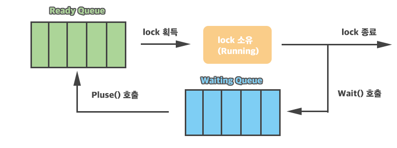

# 📝Lock

###### 참조
[Thread](./Thread.md)

---

## Race Condition
두 개 이상의 스레드가 하나의 자원에 동시에 접근할 때 생기는 문제  
하나의 스레드에서 변수의 값을 변경했음에도 다른 스레드에서는 해당 변수의 값이 변경된 사실을 알지 못할 수 있음

```C#
// 예시
Thread t1, t2;
int num;

void Start() {
    t1 = new Thread(Test);
    t2 = new Thread(Test);

    t1.Start();
    t2.Start();

    t1.Join();
    t2.Join();

    Debug.Log(num);
}

void Test() {
    for (int i = 0; i < 10000; i++) {
        num++;
    }
}
```
예측대로라면 실행 결과는 `20000`이 되어야 하지만, 실제로는 Race Condition 때문에 20000이 되지 않고, 심지어 실행할 때마다 결과가 바뀜

## lock
```C#
// 예시
Thread t1, t2;
int num;

private readonly object _lock = new object();    // 동일한 잠금 객체를 사용!

void Start() {
    t1 = new Thread(Test);
    t2 = new Thread(Test);

    t1.Start();
    t2.Start();

    t1.Join();
    t2.Join();

    Debug.Log(num);
}

void Test() {
    for (int i = 0; i < 10000; i++) {
        lock(_lock) {                    // 잠금
            num++;
        }
    }
}
```

lock 키워드로 감싼 부분은 **크리티컬 섹션**이 되어, 한 번에 한 스레드만 사용할 수 있는 코드 영역이 됨

lock의 대상이 되는 매개변수(위에서는 _lock)은 무엇이든 될 수 있지만, 외부에서 접근 가능한 **this, Type 형식, string 형식**은 피하는 것이 좋음

### Interlocked
단일 변수에 대한 **원자적 연산**을 지원해주는 클래스  
lock보다 더 빠르게 동작하기에, 간단한 연산이라면 Interlocked를 사용하는 것이 좋음
- `Interlocked.Increment(ref x);`: x에서 1을 더함, 연산 후의 값을 반환
- `Interlocked.Decrement(ref x);`: x에서 1을 뺌, 연산 후의 값을 반환
- `Interlocked.Add(ref x, value);`: x에서 value를 더함, 연산 후의 값을 반환
- `Interlocked.Exchange(ref x, newValue);`: x를 newValue값으로 대체, 교체 전의 값을 반환
- `Interlocked.CompareExchange(ref x, newValue, expectedValue);`: x가 expectedValue와 같으면 newValue로 교체, 교체 전의 값을 반환

## Monitor 클래스
### Monitor.Enter() / Monitor.Exit()
```C#
lock(_lock) {
    num++;
}
```
위 코드는 내부적으로 아래로 변환되어 동작함
```C#
Monitor.Enter(_lock);
try {
    num++;
}
finally {
    Monitor.Exit();
}
```
Exit을 하지 않는 등 휴먼 에러를 막기 위해 대부분 lock을 사용하는 것이 좋음

### Monitor.Wait() / Monitor.Pulse()
`Monitor.Wait(_lock)`: _lock을 해제하고, 해당 스레드를 WaitSleepJoin 상태로 전환 (Waiting Queue로 이동)
`Monitor.Pulse(_lock)`: Waiting Queue에 대기중인 스레드 하나를 다시 Ready Queue로 옮김

  
각 객체는 Monitor에 의해 각각의 Ready Queue와 Waiting Queue를 관리

모든 스레드가 wait 상태로 진입한다면 pulse를 할 스레드가 없어 데드락 상태에 빠지므로 유의

+) 다시 lock을 획득하는 순서는 보장할 수 없음

```C#
// 데드락이 없도록 하는 예시
private readonly object locker = new object();
private bool isPingTurn = true;

void Start() {
    Thread ping = new Thread(Ping);
    Thread pong = new Thread(Pong);
    
    ping.Start();
    pong.Start();
}

void Ping() {
    lock(locker) {
        for (int i = 0; i < 5; i++) {
            // 자신의 턴이 아닐 경우 대기 상태로 진입
            while (!isPingTurn) {
                Monitor.Wait(locker);
            }

            Debug.Log("Ping");
            isPingTurn = false;    // pong 차례로 변경
            Monitor.Pulse(locker);
        }
    }
}

void Pong() {
    lock(locker) {
        for (int i = 0; i < 5; i++) {
            // 자신의 턴이 아닐 경우 대기 상태로 진입
            while (isPingTurn) {
                Monitor.Wait(locker);
            }

            Debug.Log("Pong");
            isPingTurn = true;    // ping 차례로 변경
            Monitor.Pulse(locker);
        }
    }
}
```

while 대신 if로 조건을 검사해도 되지만, 스레드가 더 많아질 경우 자신의 턴이 아닌 경우가 계속될 수 있으므로 while로 깨어날 때마다 계속 검사하는 것이 일반적

